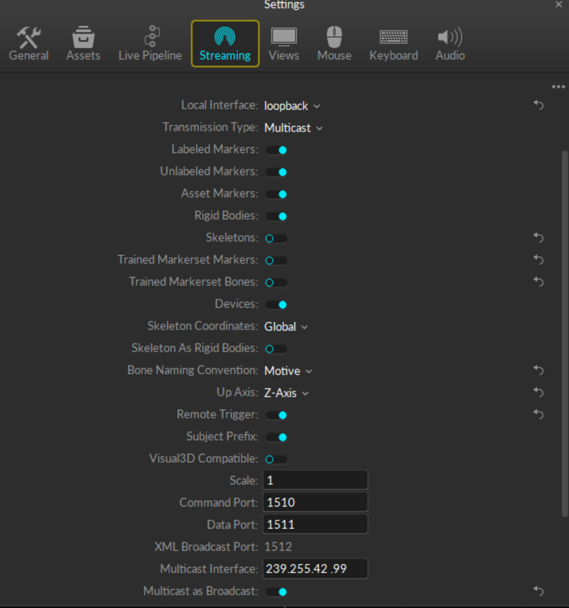
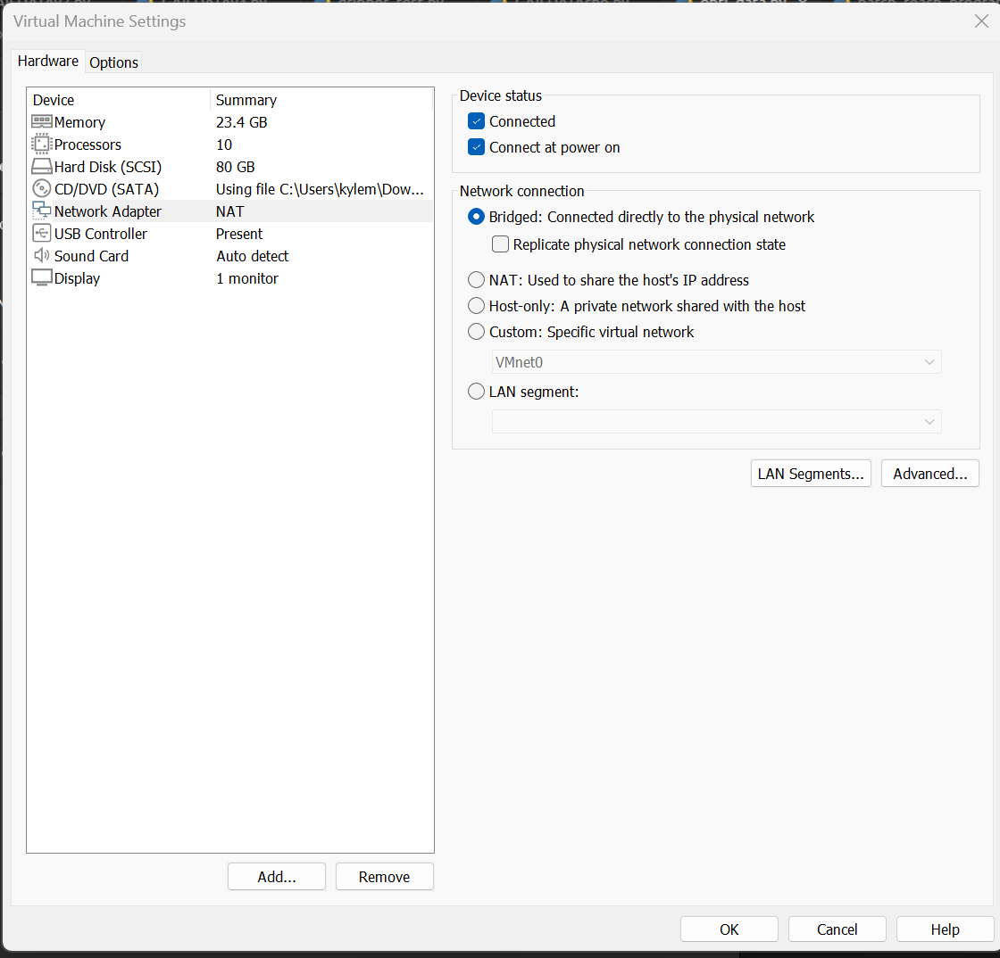
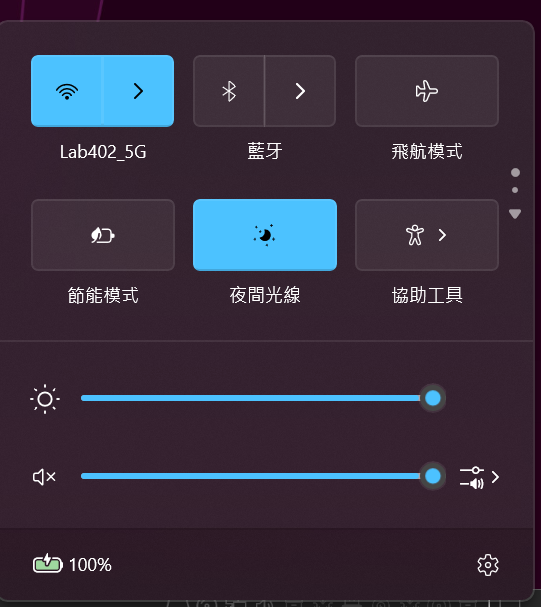
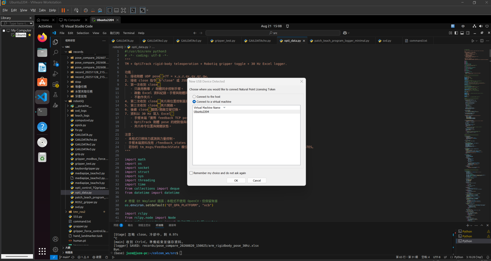
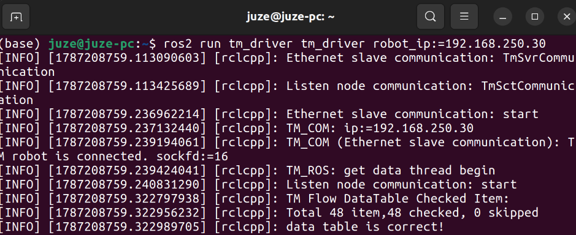

# OptiTrack 機械手臂教導系統（Windows）

本專案使用 OptiTrack 相機與 Motive 取得剛體（Rigid Body）的即時姿態，先在 Windows 端確認追蹤資料是否正確，再將座標及旋轉資訊透過 UDP 傳送至 VM 虛擬機，供後續機械手臂教導、軌跡記錄或控制程式使用。

## 系統流程

```text
OptiTrack 相機（2～4 台）
        ↓
Motive 校正、地板設定與剛體追蹤
        ↓ NatNet
Windows Python 程式
        ├─ test.py：確認剛體位置與位移
        ├─ testopen.py：觀察與測試手勢開合評分
        └─ opti_data.py：取得姿態並透過 UDP 傳送
                         ↓
                       VM 虛擬機
                         ↓
                  機械手臂教導／控制
```

## 使用前準備

- Windows 電腦
- 2～4 台 OptiTrack 相機
- Motive 軟體
- Python 3
- Windows 電腦、VM 與機械手臂使用可互通的乙太網路網段
- Python 套件：`opencv-python`、`numpy`、`mediapipe`

在專案根目錄安裝 Python 套件：

```powershell
python -m pip install -r .\requirements.txt
```

`requirements.txt` 已固定為支援目前 `mp.solutions.hands` 舊版 API 的套件版本。建議使用 Python 3.10 或 3.11 建立獨立環境，避免直接升級 MediaPipe 或 NumPy 後產生相容性問題。

> 若使用 Conda，請先啟用已安裝上述套件的環境，例如 `conda activate mediapipe`。

## 操作步驟

### 1. 架設與校正 OptiTrack

1. 架設 2～4 台 OptiTrack 相機，確保工作區域內的標記點能被多台相機看到。
2. 在 Motive 中完成相機校正（Calibration）。
3. 完成地板平面與原點設定（Ground Plane），並確認座標軸方向符合機械手臂使用需求。
4. 確認 Windows 本機乙太網路、VM 與機械手臂位於可互相連線的網段。

可先在 Windows PowerShell 測試 VM 或機械手臂的 IP：

```powershell
ping 192.168.250.100 or ping 192.168.250.30
```

若 VM 使用 NAT 而無法直接接收封包，建議改用橋接網路，或依實際環境設定 UDP 連接埠轉送及防火牆規則。

### 2. 設定 Motive Streaming

開啟 Motive 的 `Settings > Streaming`，設定內容請參考下圖：



目前程式所使用的主要設定如下：

| 項目 | 設定值 |
|---|---|
| Transmission Type | `Multicast` |
| Rigid Bodies | 開啟 |
| Command Port | `1510` |
| Data Port | `1511` |
| Multicast Interface | `239.255.42.99` |

`Local Interface` 應選擇實際接收 NatNet 資料的 Windows 網路介面。若 Motive 與 Python 程式都在同一台電腦，可使用 `loopback`；若需經由實體網卡與其他設備通訊，請依現場網路設定選擇對應介面。

### 3. 建立剛體

1. 將反光標記點固定於教導工具或欲追蹤的物件上。
2. 在 Motive 中選取標記點並建立 Rigid Body。
3. 將該 Rigid Body 的 `ID` 設為 `1`。
4. 確認 Motive 畫面中剛體可持續被追蹤，且移動時座標會更新。

程式中的目標剛體 ID 也設定為 `1`：

- `test.py`：`TARGET_RIGID_BODY_ID = 1`
- `opti_data.py`：`RIGID_BODY_ID = 1`

### 4. 使用 testopen.py 測試手勢評分

`testopen.py` 可在尚未連接 OptiTrack 或 VM 的情況下，單獨測試 MediaPipe 手勢辨識與手掌開合評分是否正確。

在 PowerShell 進入 PythonClient 目錄後執行：

```powershell
cd ".\NatNetSDK\Samples\PythonClient"
python .\testopen.py
```

程式會開啟 Windows 電腦的攝影機，並在畫面中顯示：

- 手部骨架與目前辨識到的左手／右手。
- `Right Open` 手勢開放程度分數及圖形量表。
- 控制手狀態：`OPEN`、`CLOSE` 或 `EMPTY`。
- 狀態來源：`detect` 表示本幀有偵測更新；`hold` 表示暫時沿用上一個狀態。
- 即時 FPS；終端機也會每秒輸出一次手勢狀態。

目前預設只使用右手作為控制手：

```python
CONTROL_HAND = "Right"
OPEN_THR = 0.205
CLOSE_THR = 0.205
STABILITY_FRAMES = 10
```

測試時依序將右手張開、握合，確認分數會隨動作改變，且畫面能穩定切換 `OPEN` 與 `CLOSE`。左手仍會顯示評分，但會標示為 `Ignored`，不參與狀態判定。

若狀態過於敏感、無法切換或容易閃爍，可依實際攝影機角度與使用者手勢調整 `OPEN_THR`、`CLOSE_THR`、`STABILITY_FRAMES` 及 `SMOOTH_ALPHA`。完成測試後，按 `Q` 或 `Esc` 結束程式。

### 5. 使用 test.py 測試位移

在 PowerShell 進入 PythonClient 目錄：

```powershell
cd ".\NatNetSDK\Samples\PythonClient"
python .\test.py
```

程式執行後揮動剛體，終端機應持續顯示 Rigid Body 1 的 X、Y、Z 座標。

- 按第一次 `Q`：記錄起點
- 移動剛體後再按一次 `Q`：顯示 X、Y、Z 位移、三維距離、經過時間與平均速度
- 按 `Esc`：結束程式

OptiTrack 量測出的位移有可能經過縮放，因此正式使用座標傳輸功能前，應先使用 `test.py` 校正距離倍率：

1. 將 OptiTrack 剛體穩固地安裝在機械手臂末端。
2. 執行 `test.py`，按第一次 `Q` 記錄起點。
3. 控制機械手臂沿單一座標軸精確移動 `100 mm`。
4. 再按一次 `Q`，讀取程式顯示的三維位移 `3D displacement`。
5. 使用下式計算縮放倍率：

```text
縮放倍率 = OptiTrack 量測位移（mm）÷ 機械手臂實際位移（100 mm）
```

例如機械手臂實際移動 `100 mm`，而 OptiTrack 顯示 `154 mm`：

```text
縮放倍率 = 154 ÷ 100 = 1.54
```

將計算結果填入 `opti_data.py`：

```python
ENABLE_OPTITRACK_SCALE_CORRECTION = True
OPTITRACK_DISTANCE_SCALE = 1.54
```

`opti_data.py` 會以 `1 / OPTITRACK_DISTANCE_SCALE` 修正送出的 X、Y、Z。建議沿不同座標軸重複量測數次並取平均值，以降低定位抖動及單次量測誤差。

若持續出現等待資料的訊息，請檢查 Motive Streaming 是否開啟、剛體 ID、IP、Multicast/Unicast 模式，以及 Windows 防火牆。

### 6. 使用 opti_data.py 傳送資料至 VM

執行前先確認 `opti_data.py` 頂部的網路參數符合現場環境：

```python
RIGID_BODY_ID = 1
SERVER_IP = "127.0.0.1"
CLIENT_IP = "127.0.0.1"
MCAST_ADDR = "239.255.42.99"
CMD_PORT = 1510
DATA_PORT = 1511

DEST_IP = "192.168.250.100"
DEST_PORT = 5005
DEST_CMD_PORT = 5006
```

其中：

- `SERVER_IP`：Motive 所在電腦的 IP；目前為本機。
- `CLIENT_IP`：執行 Python 程式之 Windows 網路介面的 IP；目前為本機。
- `DEST_IP`：接收資料的 VM IP。
- `DEST_PORT`：VM 接收剛體姿態資料的 UDP 連接埠。
- `DEST_CMD_PORT`：VM 接收手勢命令的 UDP 連接埠。

確認設定後執行：

```powershell
python .\opti_data.py
```

程式會同時：

1. 從 Motive 接收 Rigid Body 1 的 NatNet 資料。
2. 讀取攝影機影像，使用 MediaPipe 判斷右手張開／閉合狀態。
3. 將剛體位置與旋轉以 UDP 傳送至 VM。
4. 在符合手勢判斷條件時，將 `close` 命令傳至 VM。

按影像視窗中的 `Q` 或 `Esc` 可結束程式。

## UDP 資料格式

姿態封包使用 little-endian 的 7 個 32-bit float：

```text
x, y, z, qx, qy, qz, qw
```

Python 格式字串為：

```python
PKT_FMT = "<7f"
```

位置與四元數資料傳送至 `DEST_PORT`（預設 `5005`）；`close` 命令預設以文字位元組傳送至 `DEST_CMD_PORT`（預設 `5006`）。VM 端需使用相同格式解包。

## VMware Ubuntu 虛擬機端

VM 端主要使用以下兩支程式：

- `vmware-ubuntu/gripper_test.py`：先單獨確認 Ubuntu 能透過 USB-to-RS485 與 Robotiq 夾爪通訊。
- `vmware-ubuntu/opti_data.py`：接收 Windows 的 OptiTrack 與手勢資料，控制 TM 機械手臂和 Robotiq 夾爪，並記錄教導資料。

### VM 環境需求

開啟 VMware 的 `Virtual Machine Settings > Network Adapter`。勾選 `Connected` 與 `Connect at power on`，並將網路模式設定為 `Bridged: Connected directly to the physical network`，讓 VM 能直接加入 Windows 所連接的實體網路並與機械手臂互通。



啟動 VM 後，可分別在 Windows 與 Ubuntu 使用 `ping` 測試 VM、Windows 和機械手臂的 IP 是否互通。

有時 VMware 橋接網卡未正確重新連線，會造成 Ubuntu VM 無法連接機械手臂。遇到這種情況，可在 Windows 快速設定中將 Wi-Fi 關閉，等待數秒後再重新開啟，確認 Windows 已重新連回原本的無線網路，再回到 Ubuntu 重新測試機械手臂 IP。




VMware 的 USB 裝置設定必須將 USB-to-RS485 轉接器連接至 Ubuntu VM，而不是留在 Windows 主機。進入 Ubuntu 後確認裝置：

插入 Robotiq 夾爪的 USB-to-RS485 後，VMware 會顯示新 USB 裝置視窗。選擇 `Connect to a virtual machine`，再選取目前使用的 Ubuntu 虛擬機並按下 `OK`。若裝置已連到 Windows，可由 VMware 選單的 `VM > Removable Devices` 找到對應裝置，切換連線至 Ubuntu VM。



> USB 裝置同一時間只能由 Windows 主機或 Ubuntu VM 其中一方使用。執行夾爪程式前，必須確認裝置目前連接至 VM。

進入 Ubuntu 後確認序列裝置：

```bash
ls -l /dev/serial/by-id/
ls -l /dev/ttyUSB*
```

程式目前使用：

```text
裝置：/dev/ttyUSB0
Modbus Slave ID：9
Baud rate：115200
資料格式：8-N-1，Modbus RTU
```

若目前使用者沒有序列埠權限，可將使用者加入 `dialout` 群組，完成後登出再登入：

```bash
sudo usermod -aG dialout $USER
```

安裝 VM 端 Python 套件：

```bash
cd vmware-ubuntu
python3 -m pip install -r requirements.txt
```

VM 端的 `requirements.txt` 包含：

```text
minimalmodbus
pyserial
openpyxl
```

`rclpy` 與 `tm_msgs` 屬於 ROS 2 套件，不應使用 pip 安裝。執行主程式前，必須先載入 ROS 2 及包含 TM Driver／`tm_msgs` 的工作空間：

#### 下載官方 TM ROS 2 Humble Driver

先進入本專案目錄並記住路徑，再建立獨立的 TM Driver 工作區：

```bash
cd <專案目錄>
export HRC_PROJECT="$(pwd)"
export TMDRIVER_WS="$HOME/tmdriver_ws"

mkdir -p "$TMDRIVER_WS/src"
git clone --branch humble --single-branch \
  https://github.com/TechmanRobotInc/tmr_ros2.git \
  "$TMDRIVER_WS/src/tmr_ros2"
```

請將 `<專案目錄>` 替換為本專案在 Ubuntu VM 中的實際路徑。`HRC_PROJECT` 會保存目前專案的絕對路徑；`TMDRIVER_WS` 則指向 TM Driver 工作區。

執行後的主要目錄結構應為：

```text
~/tmdriver_ws/
└── src/
    └── tmr_ros2/
        ├── tm_driver/
        ├── tm_msgs/
        ├── tm_description/
        └── ...
```

若 `tmr_ros2` 資料夾已經存在，請勿重複執行 `git clone`。可使用以下指令確認目前分支：

```bash
git -C "$TMDRIVER_WS/src/tmr_ros2" branch --show-current
```

輸出應為：

```text
humble
```

完成 TM ROS 2 工作區的相依套件安裝與編譯後，執行主程式前載入 ROS 2 及 TM Driver 工作區：

```bash
source /opt/ros/<ros2-distro>/setup.bash
source "$TMDRIVER_WS/install/setup.bash"
```

請將 `<ros2-distro>` 改為實際版本，例如 `humble`。

### 連接 TM 機械手臂

確認 VM 能 `ping` 到機械手臂後，開啟一個已載入 ROS 2 與 TM Driver 工作空間的終端機，輸入：

```bash
ros2 run tm_driver tm_driver robot_ip:=192.168.250.30
```

其中 `192.168.250.30` 為目前機械手臂 IP；若現場設定不同，請替換成實際 IP。



終端機必須出現以下訊息，才表示 TM Driver 已正確取得機械手臂資料：

```text
TM robot is connected.
data table is correct!
```

其中應特別確認有 `data table is correct!`。只有顯示網路已連線、但沒有出現這行時，不應繼續啟動 `opti_data.py`；請檢查手臂 IP、VM 橋接網路、Windows Wi-Fi、TM Flow 外部通訊設定及 TM Driver 工作空間。

保持這個 TM Driver 終端機持續執行，另外開啟新終端機執行後續的 `gripper_test.py` 或 `opti_data.py`。

### 先執行 gripper_test.py

確認夾爪周圍沒有障礙物、人員或可能被夾住的物體，再執行：

```bash
cd vmware-ubuntu
python3 gripper_test.py
```

這支程式會：

1. 嘗試開啟 `/dev/ttyUSB0`。
2. 使用 Slave ID 9 建立 Modbus RTU 連線。
3. 呼叫 `ROS2_gripper.py` 初始化 Robotiq 夾爪。
4. 依驅動程式提供的方法送出兩次位置命令，以確認夾爪能動作。

終端機顯示 `Initializing gripper...` 後，夾爪應完成初始化與位置動作，最後顯示 `Done.`。若出現 Permission denied、找不到 `/dev/ttyUSB0` 或 Modbus timeout，請檢查 VMware USB 掛載、序列埠權限、RS485 接線、Slave ID 和鮑率。

> 目前 `gripper_test.py` 在存在 `goTomm()` 時會依序傳入 `255` 與 `0`，但 `ROS2_gripper.py` 的 `goTomm()` 使用毫米值並會限制在 0～85 mm；因此正式測試前應確認實際開關方向及單位，避免將 bit 位置值和毫米值混用。

### 執行 VM 端 opti_data.py

執行前確認：

- `gripper_test.py` 已能正常控制夾爪。
- TM Driver 已啟動，ROS 2 中可使用 `/feedback_states` 與 `send_script`。
- Windows 與 VM 網路互通。
- Ubuntu 防火牆允許 UDP 5005 與 5006。
- Windows 端 `DEST_IP` 已設定為這台 VM 的 IP。

VM 端主要設定如下：

```python
PORT = "/dev/ttyUSB0"
SLAVE_ID = 9

RB_BIND_IP = "0.0.0.0"
RB_BIND_PORT = 5005
CMD_BIND_PORT = 5006
RB_PACKET_FMT = "<7f"
RB_INPUT_UNITS = "m"

MOVE_RATIO = 1
LOG_HZ = 30.0
RECORD_ROOT = "records"
```

啟動 ROS 2/TM Driver 後，在已載入工作空間的終端機執行：

```bash
cd vmware-ubuntu
python3 opti_data.py
```

程式運作順序：

1. 初始化 Robotiq 夾爪，並開啟 UDP 5005、5006。
2. 接收 Windows 傳來的 `<7f` 剛體位置與四元數。
3. 等待 Windows 手勢程式送出 `close`。
4. 第一次收到 `close`：建立剛體與手臂的同步起點、啟用教導控制及開始 30 Hz Excel 記錄；夾爪不動作。
5. 第二次收到 `close`：關閉夾爪。
6. 第三次收到 `close`：開啟夾爪。
7. 後續每次有效的 `close` 會在關閉與開啟之間切換。
8. 按 `Ctrl+C` 結束，程式會停止接收並儲存 Excel。

`MOVE_RATIO` 是剛體位移到機械手臂位移的比例。程式註解中的定義為：`MOVE_RATIO = 10` 表示剛體移動 10 mm、手臂移動 1 mm。首次測試應使用保守倍率、低速和足夠大的安全空間。

若第一次 `close` 後記錄器沒有啟動，通常表示尚未同時收到 OptiTrack 剛體資料與 TM 手臂的實際 TCP feedback。請先檢查 UDP 封包、ROS 2 topic 以及 `FEEDBACK_POSE_FIELD_CANDIDATES` 是否符合目前的 `tm_msgs/FeedbackState`。

## 座標比例修正

`opti_data.py` 目前啟用距離比例修正：

```python
ENABLE_OPTITRACK_SCALE_CORRECTION = True
OPTITRACK_DISTANCE_SCALE = 1.54
```

送出的 X、Y、Z 會乘上 `1 / 1.54`，旋轉四元數不受影響。若現場量測不需要此修正，請將 `ENABLE_OPTITRACK_SCALE_CORRECTION` 改為 `False`；正式使用前建議以已知距離重新量測並校驗比例。

## 常見問題

- **收不到剛體資料**：確認 Motive 已開始 Streaming、Rigid Bodies 已開啟、剛體 ID 為 1，且連接埠 1510/1511 未被防火牆阻擋。
- **VM 收不到 UDP**：確認 `DEST_IP`、VM 網卡模式、VM 防火牆及 UDP 5005/5006 是否正確。
- **座標軸方向不符**：重新確認 Motive 的 Ground Plane、Up Axis，以及機械手臂座標系轉換。
- **距離比例不符**：檢查 `OPTITRACK_DISTANCE_SCALE`，使用已知距離重新校正。
- **攝影機無法開啟**：確認相機未被其他程式占用，並檢查 `cv2.VideoCapture(0)` 的裝置編號。

## 主要檔案

```text
.
├─ README.md
├─ photo/
│  ├─ 1.png           # VMware 橋接網路設定
│  ├─ 1-2.png         # Windows Wi-Fi 重新連線
│  ├─ 2.png           # Robotiq USB 裝置連接至 VM
│  ├─ 3.png           # TM Driver 連接成功畫面
│  └─ setting.png     # Motive Streaming 設定
├─ vmware-ubuntu/
│  ├─ requirements.txt # Ubuntu VM 的 Python 套件
│  ├─ gripper_test.py  # Robotiq 夾爪連線與動作測試
│  ├─ opti_data.py     # VM 端手臂、夾爪控制與資料記錄
│  └─ ROS2_gripper.py  # Robotiq Modbus RTU 驅動
└─ NatNetSDK/Samples/PythonClient/
   ├─ test.py          # 驗證剛體追蹤與位移
   ├─ testopen.py      # 觀察與測試手勢開合評分
   ├─ opti_data.py     # 傳送姿態至 VM，並進行手勢辨識
   ├─ NatNetClient.py  # NatNet Python Client
   ├─ DataDescriptions.py
   └─ MoCapData.py
```

## 使用提醒

本專案目前用於教導與資料傳輸測試。實際連接機械手臂前，應先限制工作空間、速度與加速度，確認座標轉換正確，並備妥急停與安全區域；請勿在只完成通訊測試的情況下直接驅動實體手臂。
